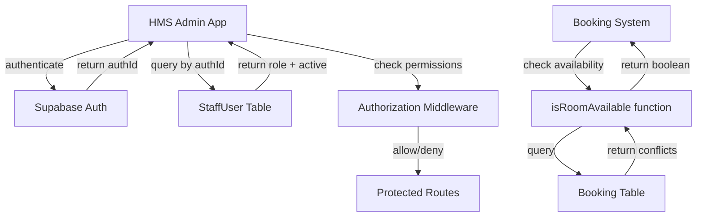
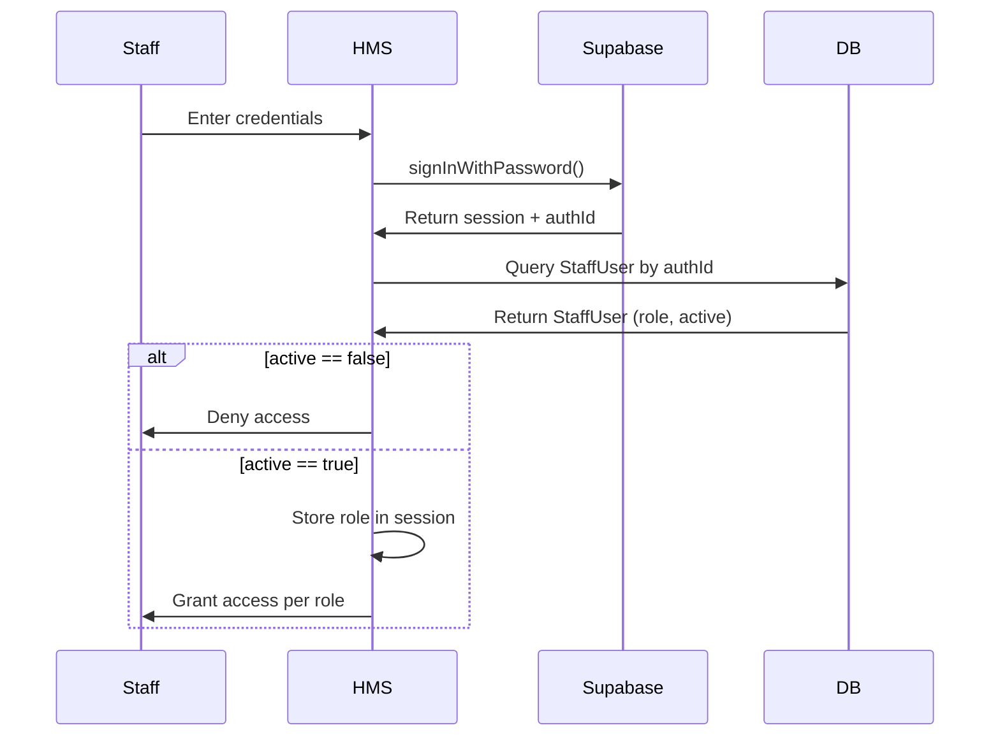

# Design Document: Staff Authentication and Availability Tests

## Overview

This design establishes a secure authentication system for hotel staff using Supabase Auth integrated with the existing StaffUser table and three-role hierarchy (RECEPTIONIST, MANAGER, OWNER). It also provides comprehensive test coverage for the existing `isRoomAvailable()` function to ensure correct double-booking prevention.

### Key Design Decisions

1. **Supabase Auth Integration**: Use Supabase as the authentication provider while maintaining the StaffUser table as the source of truth for roles and permissions
2. **Auth-to-Database Linking**: Link Supabase Auth users to StaffUser records via the `authId` field
3. **Pure Overlap Logic**: Keep `isRoomAvailable()` as pure date overlap logic with no date validation
4. **Property-Based Testing**: Use property-based testing with `fast-check` to verify availability logic across all possible inputs
5. **Middleware-Based Authorization**: Implement role-based access control using Next.js middleware

### Architecture Principles

- **Separation of Concerns**: Authentication (Supabase) is separate from authorization (application logic)
- **Single Source of Truth**: StaffUser table owns role and active status; Supabase owns credentials
- **Stateless Authorization**: Role checks happen on every request using JWT claims enriched with role data
- **Testability**: Availability logic is pure and easily testable without external dependencies

## Architecture

### Component Diagram



### Authentication Flow



### Authorization Strategy

- **JWT Enhancement**: After Supabase authentication, enrich the session with role and active status from StaffUser
- **Middleware Checks**: Next.js middleware reads role from session and enforces route-level permissions
- **Client-Side Guards**: UI components check role to hide/show features (defense in depth)

## Components and Interfaces

### 1. Supabase Client Configuration

**Location**: `packages/auth/src/supabase.ts`

**Interface**:
```typescript
import { createClient } from '@supabase/supabase-js';

export const supabaseClient = createClient(
  process.env.NEXT_PUBLIC_SUPABASE_URL!,
  process.env.NEXT_PUBLIC_SUPABASE_ANON_KEY!
);

export const supabaseServerClient = createClient(
  process.env.NEXT_PUBLIC_SUPABASE_URL!,
  process.env.SUPABASE_SERVICE_ROLE_KEY!
);
```

**Responsibility**: Provide configured Supabase clients for authentication operations

### 2. Authentication Service

**Location**: `packages/auth/src/staff-auth.ts`

**Interface**:
```typescript
import { Role } from '@prisma/client';

export interface StaffAuthResult {
  authId: string;
  staffUserId: string;
  role: Role;
  name: string;
  email: string;
  active: boolean;
}

export interface AuthService {
  signIn(email: string, password: string): Promise<StaffAuthResult>;
  signOut(): Promise<void>;
  getCurrentStaff(): Promise<StaffAuthResult | null>;
  verifyActive(authId: string): Promise<boolean>;
}
```

**Responsibility**: Handle authentication operations and link Supabase auth to StaffUser records

**Key Methods**:
- `signIn`: Authenticate with Supabase, then fetch StaffUser record and verify active status
- `signOut`: Clear Supabase session
- `getCurrentStaff`: Retrieve current authenticated staff from session
- `verifyActive`: Check if a StaffUser with given authId is active

### 3. Authorization Middleware

**Location**: `apps/admin/middleware.ts`

**Interface**:
```typescript
import { NextRequest, NextResponse } from 'next/server';
import { Role } from '@prisma/client';

interface RoutePermissions {
  [path: string]: Role[];
}

export function middleware(request: NextRequest): NextResponse;
```

**Responsibility**: Enforce role-based access control at the route level

**Permission Matrix**:
```typescript
const ROUTE_PERMISSIONS: RoutePermissions = {
  '/bookings': ['RECEPTIONIST', 'MANAGER'],
  '/check-in': ['RECEPTIONIST', 'MANAGER'],
  '/check-out': ['RECEPTIONIST', 'MANAGER'],
  '/payments': ['RECEPTIONIST', 'MANAGER'],
  '/rooms': ['MANAGER'],
  '/rates': ['MANAGER'],
  '/reports': ['MANAGER'],
  '/dashboard': ['OWNER'],
};
```

### 4. Staff User Provider

**Location**: `packages/auth/src/staff-provider.tsx`

**Interface**:
```typescript
import { Role } from '@prisma/client';

export interface StaffContext {
  staff: StaffAuthResult | null;
  isLoading: boolean;
  hasRole: (roles: Role[]) => boolean;
}

export function StaffProvider({ children }: { children: React.ReactNode }): JSX.Element;
export function useStaff(): StaffContext;
```

**Responsibility**: Provide React context for accessing current staff information in components

### 5. Availability Checker (Existing)

**Location**: `packages/db/src/availability.ts`

**Interface**:
```typescript
export function isRoomAvailable(
  roomId: string,
  checkIn: Date,
  checkOut: Date,
  excludeBookingId?: string
): Promise<boolean>;
```

**Responsibility**: Check if a room is available for a given date range by detecting overlaps with active bookings

**Overlap Detection Logic**:
- A conflict exists when: `checkIn < existingCheckOut AND checkOut > existingCheckIn`
- Only considers bookings with status: PENDING, CONFIRMED, or CHECKED_IN
- Optionally excludes a specific booking (for edit scenarios)

### 6. Test Suite

**Location**: `packages/db/src/__tests__/availability.test.ts`

**Testing Libraries**:
- **Jest**: Test runner and assertion library
- **fast-check**: Property-based testing library for TypeScript
- **@prisma/client**: Database access for test setup

**Test Structure**:
- Unit tests: Specific scenarios and edge cases
- Property tests: Universal properties verified across generated inputs

## Data Models

### StaffUser (Existing Schema)

```prisma
model StaffUser {
  id        String   @id @default(uuid())
  authId    String   @unique
  name      String
  email     String   @unique
  role      Role
  active    Boolean  @default(true)
  createdAt DateTime @default(now())

  bookingsCreated Booking[]  @relation("CreatedByStaff")
  paymentsHandled Payment[]  @relation("HandledByStaff")
  auditLogs       AuditLog[]
}
```

**Key Fields**:
- `authId`: Links to Supabase Auth user ID (unique)
- `role`: One of RECEPTIONIST, MANAGER, OWNER
- `active`: Controls whether staff member can access the system

### Booking (Existing Schema)

```prisma
model Booking {
  id          String        @id @default(uuid())
  reference   String        @unique
  guestId     String
  roomId      String
  checkIn     DateTime
  checkOut    DateTime
  status      BookingStatus @default(PENDING)
  source      BookingSource
  totalAmount Decimal       @db.Decimal(10, 2)
  createdById String?
  notes       String?
  createdAt   DateTime      @default(now())
  updatedAt   DateTime      @updatedAt

  guest     Guest       @relation(fields: [guestId], references: [id])
  room      Room        @relation(fields: [roomId], references: [id])
  createdBy StaffUser?  @relation("CreatedByStaff", fields: [createdById], references: [id])
  payments  Payment[]
  auditLogs AuditLog[]

  @@index([roomId, checkIn, checkOut])
  @@index([status])
}
```

**Relevant Fields for Availability**:
- `roomId`: Identifies the room
- `checkIn`: Start date of booking
- `checkOut`: End date of booking
- `status`: Booking status (only PENDING, CONFIRMED, CHECKED_IN count as conflicts)

### Supabase Auth User

Supabase manages the `auth.users` table with standard fields:
- `id`: UUID (maps to StaffUser.authId)
- `email`: Email address
- `encrypted_password`: Hashed password
- `email_confirmed_at`: Email verification timestamp

**Integration Point**: After Supabase authentication returns a user ID, the application queries StaffUser by authId to get role and active status.

## Environment Configuration

### Required Environment Variables

**Supabase Configuration**:
- `NEXT_PUBLIC_SUPABASE_URL`: Supabase project URL
- `NEXT_PUBLIC_SUPABASE_ANON_KEY`: Supabase anonymous key (client-side)
- `SUPABASE_SERVICE_ROLE_KEY`: Supabase service role key (server-side only)

**Database Configuration** (existing):
- `DATABASE_URL`: PostgreSQL connection string

### Security Considerations

- Service role key must never be exposed to client-side code
- Use Row Level Security (RLS) in Supabase if storing additional auth metadata
- Rotate keys periodically
- Use environment-specific projects (dev, staging, prod)


## Error Handling

### Authentication Errors

**Invalid Credentials**:
- **Scenario**: User provides incorrect email or password
- **Handling**: Supabase returns error, display "Invalid credentials" message
- **Security**: Use generic message to avoid user enumeration

**Inactive Staff Account**:
- **Scenario**: Authentication succeeds but `active == false`
- **Handling**: Deny access with message "Account is inactive. Contact administrator."
- **Logging**: Record failed access attempt in audit log

**Missing StaffUser Record**:
- **Scenario**: Supabase auth succeeds but no StaffUser with matching authId
- **Handling**: Sign out user, display "Account configuration error. Contact administrator."
- **Recovery**: Administrator must create StaffUser record with correct authId

**Network Errors**:
- **Scenario**: Cannot reach Supabase or database
- **Handling**: Display "Connection error. Please try again."
- **Retry**: Implement exponential backoff for transient failures

### Authorization Errors

**Insufficient Permissions**:
- **Scenario**: Staff member attempts to access route not allowed for their role
- **Handling**: Redirect to default dashboard with message "You don't have permission to access that feature."

**Session Expiration**:
- **Scenario**: JWT token expires during session
- **Handling**: Redirect to login page with message "Session expired. Please sign in again."
- **Prevention**: Implement token refresh before expiration

### Availability Checking Errors

**Database Query Failure**:
- **Scenario**: Prisma query fails due to connection or database error
- **Handling**: Throw error to caller with context
- **User Impact**: Booking creation fails with "Unable to check availability. Please try again."
- **Logging**: Log full error details for debugging

**Invalid Date Range**:
- **Scenario**: Caller provides checkOut before checkIn
- **Handling**: Validate at the caller level (not in isRoomAvailable)
- **User Impact**: Display validation error: "Check-out date must be after check-in date."

**Missing Room**:
- **Scenario**: roomId does not exist in database
- **Handling**: isRoomAvailable returns true (no conflicts found)
- **Note**: Room existence should be validated separately before calling availability check

### Test Failures

**Property Test Failure**:
- **Scenario**: Property-based test finds counterexample
- **Handling**: fast-check reports the failing input
- **Action**: Fix the bug in isRoomAvailable or test logic, then re-run
- **Documentation**: Record the counterexample in a regression test

**Database State Issues**:
- **Scenario**: Tests fail due to leftover data or constraint violations
- **Handling**: Use transaction rollback or database cleanup in beforeEach/afterEach
- **Isolation**: Each test should start with a clean database state

## Testing Strategy

### Overview

This feature requires a dual testing approach:
1. **Unit Tests**: Verify specific examples, edge cases, and error conditions
2. **Property Tests**: Verify universal properties across all possible inputs

Both approaches are complementary and necessary for comprehensive coverage.

### Unit Testing

**Purpose**: Verify specific scenarios and edge cases

**Test Cases**:
- Sign-in with valid credentials returns correct StaffUser data
- Sign-in with invalid credentials throws error
- Sign-in with inactive staff account denies access
- Authorization middleware blocks unauthorized role from protected route
- Authorization middleware allows authorized role to protected route
- isRoomAvailable returns true when no bookings exist
- isRoomAvailable returns false when booking overlaps
- Same-day check-in/check-out is allowed (boundary condition)
- CANCELLED bookings don't block availability
- excludeBookingId parameter ignores specified booking

**Testing Tools**:
- Jest for test runner and assertions
- @supabase/auth-helpers-nextjs for mocking auth
- Prisma Client for database operations in tests

**Test Database**:
- Use separate test database (DATABASE_URL_TEST)
- Reset database state before each test
- Use Prisma transactions for test isolation

### Property-Based Testing

**Purpose**: Verify universal correctness properties across many generated inputs

**Library**: fast-check (TypeScript property-based testing library)

**Configuration**:
- Minimum 100 iterations per property test
- Each property test tagged with reference to design document property
- Tag format: `Feature: staff-auth-and-availability-tests, Property {number}: {property_text}`

**Why Property-Based Testing**:
- Availability checking involves complex date logic with many edge cases
- Manually writing tests for all combinations is impractical
- Property tests generate hundreds of random inputs to find bugs
- Catches corner cases that developers don't think of

**Property Test Structure**:
```typescript
import fc from 'fast-check';

describe('isRoomAvailable properties', () => {
  it('Property 1: ...', async () => {
    await fc.assert(
      fc.asyncProperty(
        // Generators for test inputs
        fc.uuid(),
        fc.date(),
        fc.date(),
        async (roomId, date1, date2) => {
          // Setup
          // Execute
          // Assert property
        }
      ),
      { numRuns: 100 }
    );
  });
});
```

### Integration Testing

**Scope**: Test complete authentication and authorization flow

**Scenarios**:
- Complete sign-in flow from login page to dashboard
- Role-based route access across all protected routes
- Booking creation with availability checking
- Token refresh and session management

**Tools**:
- Playwright or Cypress for end-to-end tests
- Test against real Supabase test project
- Use test database with known data

### Test Data Management

**Staff Users**:
- Create test staff users for each role
- Use consistent test credentials
- Reset active status between tests

**Bookings**:
- Generate test bookings with known date ranges
- Cover all booking statuses
- Include edge cases (same-day, adjacent, overlapping)

**Rooms**:
- Create test rooms with unique numbers
- Reuse same rooms across tests for consistency

### Continuous Integration

**Pre-commit**:
- Run unit tests
- Run type checking
- Run linting

**CI Pipeline**:
- Run full test suite (unit + property + integration)
- Generate coverage report (target: >90% for auth code, 100% for availability)
- Block merge if tests fail


## Correctness Properties

*A property is a characteristic or behavior that should hold true across all valid executions of a system—essentially, a formal statement about what the system should do. Properties serve as the bridge between human-readable specifications and machine-verifiable correctness guarantees.*

### Property 1: Inactive staff access denial

*For any* StaffUser record where `active == false`, attempting authentication with valid Supabase credentials should deny access regardless of role.

**Validates: Requirements 1.4**

### Property 2: Unauthorized role access prevention

*For any* staff member with role R and any route that does not permit role R, attempting to access that route should result in denial (redirect or 403 error).

**Validates: Requirements 2.4**

### Property 3: Empty room availability

*For any* room and any date range where no bookings with status PENDING, CONFIRMED, or CHECKED_IN exist, `isRoomAvailable()` should return true.

**Validates: Requirements 3.1**

### Property 4: Overlapping booking detection

*For any* room with an existing active booking (PENDING, CONFIRMED, or CHECKED_IN) and any date range where `checkIn < existingCheckOut AND checkOut > existingCheckIn`, `isRoomAvailable()` should return false.

**Validates: Requirements 3.2, 3.4**

### Property 5: Exclude booking parameter

*For any* room with an active booking that would normally create a conflict, if that booking's ID is passed as `excludeBookingId`, then `isRoomAvailable()` should return true (assuming no other conflicts exist).

**Validates: Requirements 3.3**

### Property 6: Booking status filtering

*For any* booking, it should only be considered a conflict if its status is PENDING, CONFIRMED, or CHECKED_IN. Bookings with status CANCELLED or CHECKED_OUT should not prevent availability.

**Validates: Requirements 3.5, 3.6**

### Property 7: Past date acceptance

*For any* date range where both checkIn and checkOut are in the past, `isRoomAvailable()` should process the request without rejecting based on date validation (pure overlap logic only).

**Validates: Requirements 4.4**

### Property 8: Boundary non-overlap (same-day turnaround)

*For any* room with a booking that checks out at time T, a new booking that checks in at time T should not conflict (boundaries touching without overlap is allowed).

**Validates: Requirements 4.1, 4.2**

**Edge Cases Handled by Generators:**
- Zero-duration bookings (checkIn == checkOut) - validated through property 4
- Special characters in credentials - validated through property 1
- Concurrent same-day turnarounds - validated through property 8

